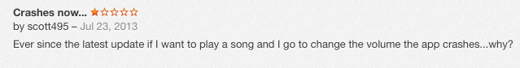
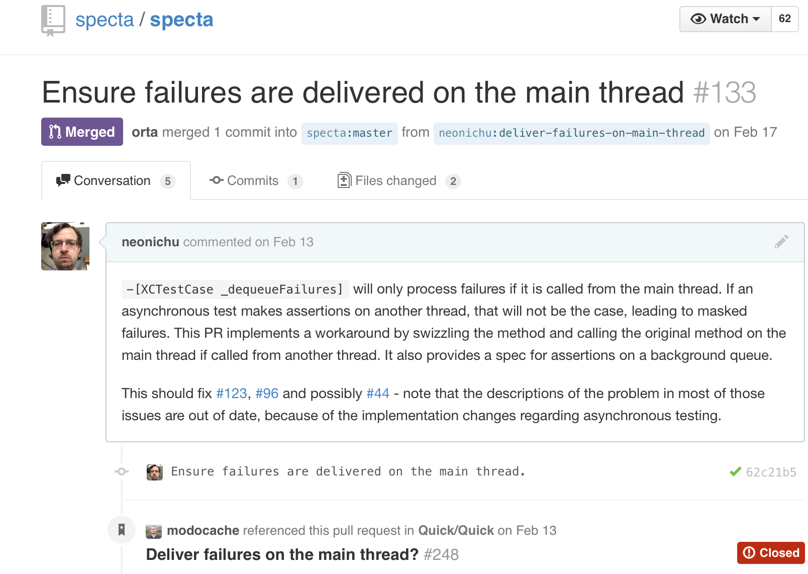
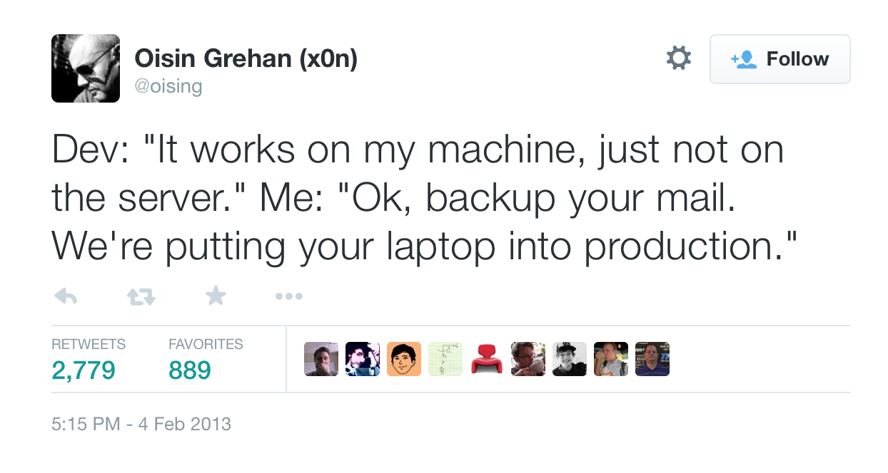
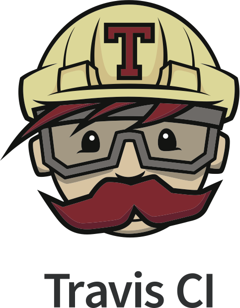
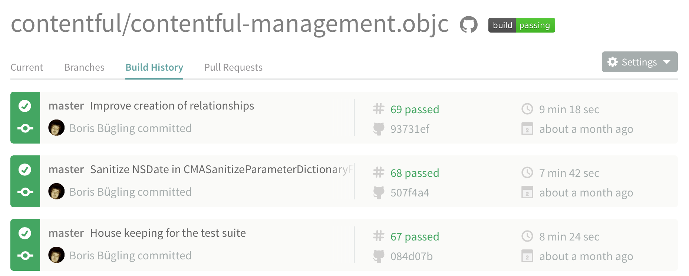
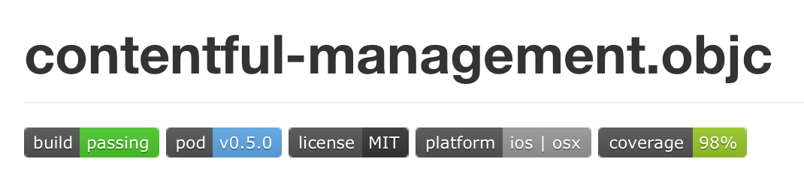
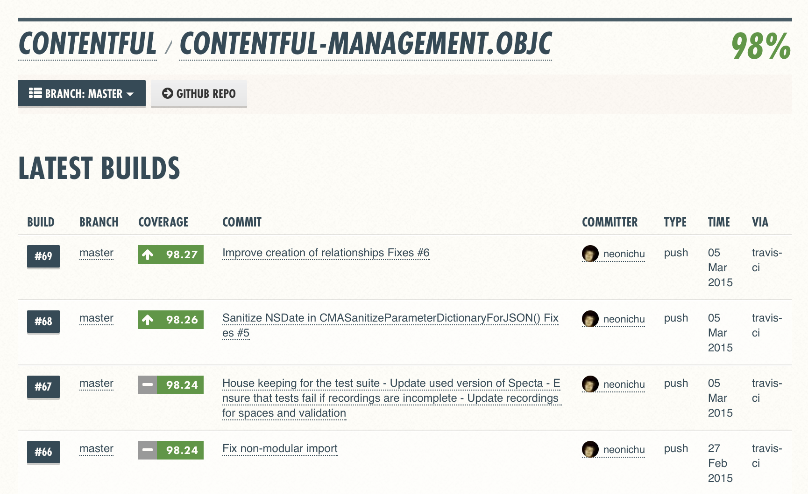
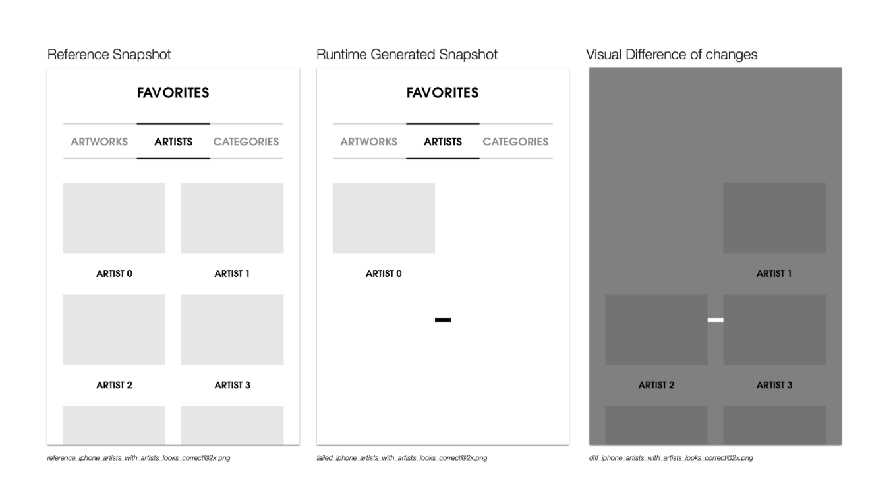
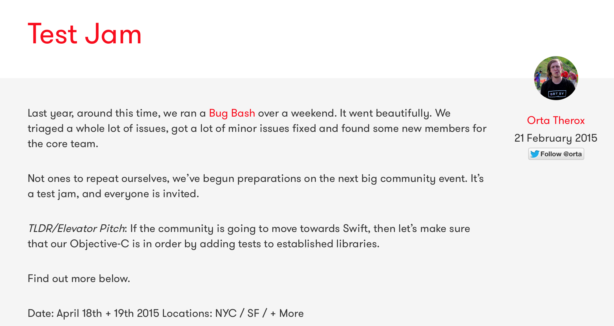
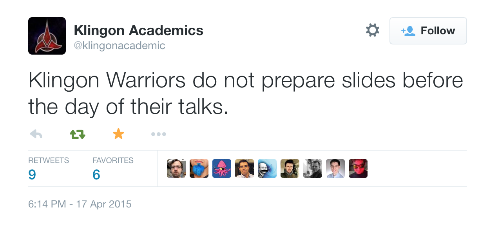

# TDD is dead - or is it?

## Mobile Days, April 2015

### Boris Bügling - @NeoNacho


---

## CocoaPods


---

## Contentful


---

# Y U TEST?


---

### (╯°□°）╯︵ ┻━┻ 

---


---


---


---

# Users hate it even more



---

# Software quality

---

```c
// I am not sure if we need this, 
// but too scared to delete.
```

---

```java
/**
 * Always returns true.
 */
public boolean isAvailable() {
    return false;
}
```

---

# Maintainability

---

> Untested code is legacy code the instant its born.

---

## If you like then you should have put a test on it.


---

# What is a test?

---

### An automated program that describes intent and and verifies behaviour repeatably.

---

# Automated

---

# Describes Intent

---

# Verifies Behaviour

---

# Repeatable

---

# Structure

1. set up (*given*)
2. do something (*when*)
3. verify something was done correctly (*then*)

---

# XCTest

---

```swift
import XCTest

class YOLOTests : XCTestCase {
    func testSomething() {
        // ...
    }
}
```

---

```swift
func testThatItDoesURLEncoding() {
    // given
    let searchQuery = "$&?@"
    let request = HTTPRequest(URL:@"/search?q=%@", searchQuery)

    // when
    let encodedURL = request.URL

    // then
    XCTAssertEqual(encodedURL, "/search?q=%24%26%3F%40")
}
```

---

```swift
override func setUp() {
    super.setUp()
    // Put setup code here. This method is called before 
    // the invocation of each test method in the class.
}
```

---

```swift
override func tearDown() {
    // Put teardown code here. This method is called after
    // the invocation of each test method in the class.
    super.tearDown()
}
```

---

# Test Assertions

---

# Fundamental Tests

```swift
XCTAssert(expression, format...)
```

---

# Boolean Tests

```swift
XCTAssertTrue(expression, format...)
XCTAssertFalse(expression, format...)
```

---

# Equality Tests

```swift
XCTAssertEqual(expression1, expression2, format...)
XCTAssertNotEqual(expression1, expression2, format...)
```

---

# Floating Point Tests

```swift
XCTAssertEqualWithAccuracy(expression1, expression2, accuracy, format...)
XCTAssertNotEqualWithAccuracy(expression1, expression2, accuracy, format...)
```

---

# Nil Tests

```swift
XCTAssertNil(expression, format...)
XCTAssertNotNil(expression, format...)
```

---

# Unconditional Failure

```swift
XCTFail(format...)
```

---

# ⌘ U

---

# Test Navigator


---

# xcodebuild test

```bash
Test Suite 'All tests' started at 2015-04-18 07:37:51 +0000
Test Suite 'Tests.xctest' started at 2015-04-18 07:37:51 +0000
Test Suite 'AssetSpec' started at 2015-04-18 07:37:51 +0000
Test Case '-[AssetSpec test_Asset__can_be_archived]' started.
2015-04-18 10:37:51.637 ManagementSDK[32645:1001618] CLTilesManagerClient: initialize, sSharedTilesManagerClient
2015-04-18 10:37:51.637 ManagementSDK[32645:1001618] CLTilesManagerClient: init
2015-04-18 10:37:51.637 ManagementSDK[32645:1001618] CLTilesManagerClient: reconnecting, 0x78eb4100
Test Case '-[AssetSpec test_Asset__can_be_archived]' passed (1.317 seconds).
Test Case '-[AssetSpec test_Asset__can_be_created]' started.
Test Case '-[AssetSpec test_Asset__can_be_created]' passed (1.033 seconds).
Test Case '-[AssetSpec test_Asset__can_be_created_with_userdefined_identifier]' started.
Test Case '-[AssetSpec test_Asset__can_be_created_with_userdefined_identifier]' passed (1.051 seconds).
Test Case '-[AssetSpec test_Asset__can_be_deleted]' started.
Test Case '-[AssetSpec test_Asset__can_be_deleted]' passed (1.037 seconds).
Test Case '-[AssetSpec test_Asset__can_process_its_file]' started.
Test Case '-[AssetSpec test_Asset__can_process_its_file]' passed (1.042 seconds).
```

---

# xcodebuild test | xcpretty

```bash
Executing `/usr/bin/xcodebuild -workspace ManagementSDK.xcworkspace \ 
    -scheme 'ManagementSDK' -sdk iphonesimulator8.4 \
    -destination name\=iPhone\ 4s clean build test  | \
    xcpretty -c ; exit ${PIPESTATUS[0]}`
[...]

** TEST FAILED **

All tests
Test Suite Tests.xctest started
AssetSpec
    ✓ test_Asset__can_be_archived (1.253 seconds)
    ✓ test_Asset__can_be_created (1.034 seconds)
    ✓ test_Asset__can_be_created_with_userdefined_identifier (1.049 seconds)
    ✓ test_Asset__can_be_deleted (1.051 seconds)
    ✓ test_Asset__can_process_its_file (1.041 seconds)
    ✓ test_Asset__can_be_published_successfully (1.053 seconds)
    ✓ test_Asset__cannot_be_published_without_associated_file (1.040 seconds)
    ✓ test_Asset__cannot_be_unpublished_from_draft_state (1.040 seconds)
    ✓ test_Asset__can_be_unarchived (1.038 seconds)
    ✓ test_Asset__can_be_updated (1.042 seconds)
    ✓ test_Asset__can_update_its_file (1.054 seconds)
```

---

# xctester

```bash
$ xctester Code/*.swift Tests/*.swift

ChoreTests

✅  -[ChoreTests testFailsToExecuteDirectory]
✅  -[ChoreTests testFailsToExecuteNonExecutableFile]
✅  -[ChoreTests testFailsWithNonExistingCommand]
✅  -[ChoreTests testPipeClosureIntoCommand]
✅  -[ChoreTests testPipeFail]
✅  -[ChoreTests testPipeStringIntoCommand]
✅  -[ChoreTests testPipeToClosure]
✅  -[ChoreTests testPipeToClosureFail]
✅  -[ChoreTests testPipeWithArguments]
✅  -[ChoreTests testResolvesCommandPathsIfNotAbsolute]
✅  -[ChoreTests testResult]
✅  -[ChoreTests testSimplePipe]
✅  -[ChoreTests testStandardError]
✅  -[ChoreTests testStandardOutput]

 Executed 14 tests, with 0 failures (0 unexpected) in 1.583 seconds
```

---

## Make the test fail *first*

---

## Test *what* is being done, not *how* it is being done

---

## Do **not** change tests during refactoring

---

# TDD


---

## Test Driven Development

---

## Write your tests before your implementation

---


---

### Not always applicable, but important when *fixing bugs*

---

# BDD

---

## Behaviour Driven Development

---

## Describe behaviour at a higher level

---

# Quick & Nimble

---

```swift
import Quick
import Nimble

class TableOfContentsSpec: QuickSpec {
  override func spec() {
    describe("the 'Documentation' directory") {
      it("has everything you need to get started") {
        let sections = Directory("Documentation").sections
        expect(sections).to(contain("Organized Tests with Quick Examples and Example Groups"))
        expect(sections).to(contain("Installing Quick"))
      }

      context("if it doesn't have what you're looking for") {
        it("needs to be updated") {
          let you = You(awesome: true)
          expect{you.submittedAnIssue}.toEventually(beTruthy())
        }
      }
    }
  }
}
```

---

- *describe* the system under test
- state what *it* should do
- check if it did what you *expect*

---

- Specta / Expecta
- Kiwi
- ...

---

## + More readable tests

---

## - What if your framework has bugs?

---



---

## ¯\\\_(ツ)\_/¯ 

---

# CI

---

## Continuous Integration

---



---

## Automate building and testing your software

---

## Do it continuously

---

## Continuous Deployment

---

## Build and ship a .app to testers automatically

---

# Jenkins


---

```java
hudson.util.IOException2: revision check failed on http://svn.myCompanyRepo.com/path/to/project
    at hudson.scm.SubversionChangeLogBuilder.buildModule(SubversionChangeLogBuilder.java:189)
    at hudson.scm.SubversionChangeLogBuilder.run(SubversionChangeLogBuilder.java:132)
    at hudson.scm.SubversionSCM.calcChangeLog(SubversionSCM.java:738)
    at hudson.scm.SubversionSCM.checkout(SubversionSCM.java:899)
    at hudson.model.AbstractProject.checkout(AbstractProject.java:1414)
    at hudson.model.AbstractBuild$AbstractBuildExecution.defaultCheckout(AbstractBuild.java:671)
    at jenkins.scm.SCMCheckoutStrategy.checkout(SCMCheckoutStrategy.java:88)
    at hudson.model.AbstractBuild$AbstractBuildExecution.run(AbstractBuild.java:580)
    at hudson.model.Run.execute(Run.java:1676)
    at hudson.model.FreeStyleBuild.run(FreeStyleBuild.java:43)
    at hudson.model.ResourceController.execute(ResourceController.java:88)
    at hudson.model.Executor.run(Executor.java:231)
Caused by: org.tmatesoft.svn.core.SVNCancelException: [etc...]
```

---

# Travis CI



---

- Hosted CI
- Free for open source
- Integrates with GitHub, ...

---

```ruby
language: objective-c
cache:
- bundler
before_install:
- bundle install
- bundle exec pod keys set ManagementAPIAccessToken \
    $CONTENTFUL_MANAGEMENT_API_ACCESS_TOKEN ManagementSDK
- bundle exec pod install
script: bundle exec pod lib coverage
```

---



---



---

# Code coverage

---

# Slather

```bash
$ slather setup path/to/project.xcodeproj
$ slather coverage -s path/to/project.xcodeproj
```

---

# CocoaPods plugin 

```ruby
plugin 'slather'
```

in your Podfile

---

# cocoapods-coverage

```bash
$ pod lib coverage
Running tests for ConcordeTests

[...]

Code/CCBufferedImageDecoder.m: 115 of 141 lines (81.56%)
Test Coverage: 81.56%
```

---

# Coveralls



---

# Puncover Plugin


---

## No code coverage for Swift, yet

---


---

# Advanced testing

---

# Asynchronous Tests

---

## Create expectation

```swift
let expectation = expectationWithDescription("...")
```

---

## Wait for fulfillment

```swift
waitForExpectationsWithTimeout(10) { (error) in
    // ...
}
```

---

## Fulfill expectation

```swift
expectation.fulfill()
```

---

```swift
func testAsynchronousURLConnection() {
    let URL = NSURL(string: "http://nshipster.com/")!
    let expectation = expectationWithDescription("GET \(URL)")

    let session = NSURLSession.sharedSession()
    let task = session.dataTaskWithURL(URL) { (data, response, error) in
        XCTAssertNotNil(data, "data should not be nil")
        XCTAssertNil(error, "error should be nil")

        if let HTTPResponse = response as NSHTTPURLResponse {
            XCTAssertEqual(HTTPResponse.URL.absoluteString, URL, "HTTP response URL should be equal to original URL")
            XCTAssertEqual(HTTPResponse.statusCode, 200, "HTTP response status code should be 200")
            XCTAssertEqual(HTTPResponse.MIMEType as String, "text/html", "HTTP response content type should be text/html")
        } else {
            XCTFail("Response was not NSHTTPURLResponse")
        }

        expectation.fulfill()
    }

    task.resume()

    waitForExpectationsWithTimeout(task.originalRequest.timeoutInterval) { (error) in
        task.cancel()
    }
}
```

---

# Performance Tests

---

```swift
func testDateFormatterPerformance() {
    let dateFormatter = NSDateFormatter()
    dateFormatter.dateStyle = .LongStyle
    dateFormatter.timeStyle = .ShortStyle

    let date = NSDate()

    measureBlock() {
        let string = dateFormatter.stringFromDate(date)
    }
}
```

---

```bash
Test Case '-[_Tests testDateFormatterPerformance]' started.
<unknown>:0: Test Case '-[_Tests testDateFormatterPerformance]' measured [Time, seconds]
 average: 0.000, relative standard deviation: 242.006%, values: [0.000441, 0.000014, 
 0.000011, 0.000010, 0.000010, 0.000010, 0.000010, 0.000010, 0.000010, 0.000010], 
 performanceMetricID:com.apple.XCTPerformanceMetric_WallClockTime, baselineName: "", 
 baselineAverage: , maxPercentRegression: 10.000%, 
 maxPercentRelativeStandardDeviation: 10.000%, maxRegression: 0.100, 
 maxStandardDeviation: 0.100
Test Case '-[_Tests testDateFormatterPerformance]' passed (0.274 seconds).
```

---

# Testing UI

---

# UI Automation

---

```js
var testName = "Test 1";
var target = UIATarget.localTarget();
var app = target.frontMostApp();
var window = app.mainWindow();

UIALogger.logStart( testName );
app.logElementTree();

//-- select the elements
UIALogger.logMessage( "Select the first tab" );
var tabBar = app.tabBar();
var selectedTabName = tabBar.selectedButton().name();
if (selectedTabName != "First") {
    tabBar.buttons()["First"].tap();
}
```

---

# KIF

---

```objc
#import "LoginTests.h"
#import "KIFUITestActor+EXAdditions.h"

@implementation LoginTests

- (void)beforeEach
{
    [tester navigateToLoginPage];
}

- (void)afterEach
{
    [tester returnToLoggedOutHomeScreen];
}

- (void)testSuccessfulLogin
{
    [tester enterText:@"user@example.com" intoViewWithAccessibilityLabel:@"Login User Name"];
    [tester enterText:@"thisismypassword" intoViewWithAccessibilityLabel:@"Login Password"];
    [tester tapViewWithAccessibilityLabel:@"Log In"];

    // Verify that the login succeeded
    [tester waitForTappableViewWithAccessibilityLabel:@"Welcome"];
}

@end
```

---

# Snapshot testing

---



---

```objc
@interface ORSnapshotTestCase : FBSnapshotTestCase
@end

@implementation ORSnapshotTestCase

- (void)testHasARedSquare
{
    // Removing this will verify instead of recording
    self.recordMode = YES;

    UIView *view = [[UIView alloc] initWithFrame:CGRectMake(0, 0, 80, 80)];
    view.backgroundColor = [UIColor redColor];
    FBSnapshotVerifyView(view, nil);
}

@end
```

---

# Testing Networking

---

## Tests should be fast

---

## => Use static data

---

# OHHTTPStubs

```objc
[OHHTTPStubs stubRequestsPassingTest:^BOOL(NSURLRequest *request) {
    return [request.URL.host isEqualToString:@"mywebservice.com"];
} withStubResponse:^OHHTTPStubsResponse*(NSURLRequest *request) {
    // Stub it with our "wsresponse.json" stub file
    NSString* fixture = OHPathForFileInBundle(@"wsresponse.json",nil);
    return [OHHTTPStubsResponse responseWithFileAtPath:fixture
              statusCode:200 headers:@{@"Content-Type":@"application/json"}];
}];
```

---

# Mockingjay

```swift
let body = [ "user": "Kyle" ]
stub(uri("/{user}/{repository}"), json(body))
```

---

- Nocilla
- CCLRequestReplay
- VCRURLConnection
- ...

---

```objc
#define RECORD_TESTCASE     beforeAll(^{ \
[[BBURecordingHelper sharedHelper] loadRecordingsForTestCase:[self class]]; \
}); \
\
afterAll(^{ \
[[BBURecordingHelper sharedHelper] storeRecordingsForTestCase:[self class]]; \
});

@interface BBURecordingHelper : NSObject

+(instancetype)sharedHelper;

@property (nonatomic, readonly, getter = isReplaying) BOOL replaying;

-(void)loadRecordingsForTestCase:(Class)testCase;
-(void)storeRecordingsForTestCase:(Class)testCase;

@end
```

---

## Making failures meaningful and actionable

---

# Mocking

---

```objc
// mock creation
NSMutableArray *mockArray = mock([NSMutableArray class]);

// using mock object
[mockArray addObject:@"one"];
[mockArray removeAllObjects];

// verification
[verify(mockArray) addObject:@"one"];
[verify(mockArray) removeAllObjects];
```

---

# Stubbing

---

```objc
// mock creation
NSArray *mockArray = mock([NSArray class]);

// stubbing
[given([mockArray objectAtIndex:0]) willReturn:@"first"];
[given([mockArray objectAtIndex:1]) willThrow:[NSException exceptionWithName:@"name"
                                                                      reason:@"reason"
                                                                    userInfo:nil]];

// following prints "first"
NSLog(@"%@", [mockArray objectAtIndex:0]);

// follows throws exception
NSLog(@"%@", [mockArray objectAtIndex:1]);

// following prints "(null)" because objectAtIndex:999 was not stubbed
NSLog(@"%@", [mockArray objectAtIndex:999]);
```

---

# Property based testing

---

- QuickCheck
- Fox 

---

```objc
FOXAssert(FOXForAll(FOXTuple(FOXInteger(), FOXInteger()), ^BOOL(NSArray *values){
    NSInteger x = [tuple[0] integerValue];
    NSInteger y = [tuple[1] integerValue];
    return x + y > x;
});
```

---

# Going from here

---

- <https://developer.apple.com/library/mac/documentation/DeveloperTools/Conceptual/testing_with_xcode/Introduction/Introduction.html>

- http://nshipster.com/xctestcase/

- Jon Reid's blog: <http://qualitycoding.org>

- <http://www.objc.io/issue-15/snapshot-testing.html>

- "Test-Driven iOS Development" by Graham Lee

---

# IOS UNIT TESTING: BEYOND THE MODEL

EFE06706 - 20% off valid until the end of April

<http://www.catehuston.com/blog/2015/04/15/launching-ios-unit-testing-beyond-the-model/>

---



---

# Thank you!


---



---

@NeoNacho

boris@contentful.com

https://github.com/neonichu

http://buegling.com/talks

http://www.contentful.com
